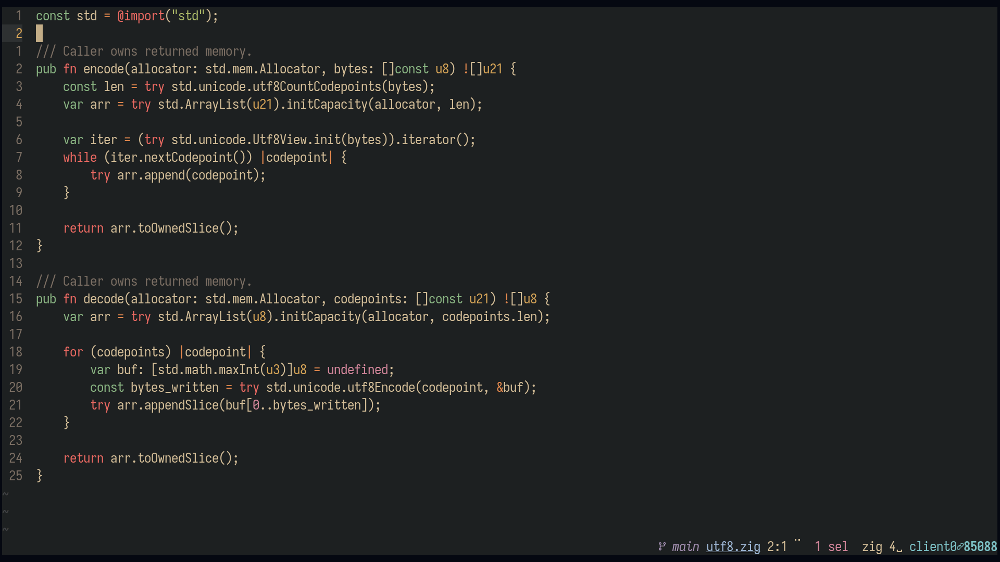

# `gruvbox-soft.kak`

## Installation

Copy `gruvbox-soft.kak` to `~/.config/kak/colors/`. If there's no
`colors/` directory under `~/.config/kak/`, create it too.

``` sh
mkdir -p ~/.config/kak/colors
cp -i gruvbox-soft.kak ~/.config/kak/colors
```

## Screenshot


